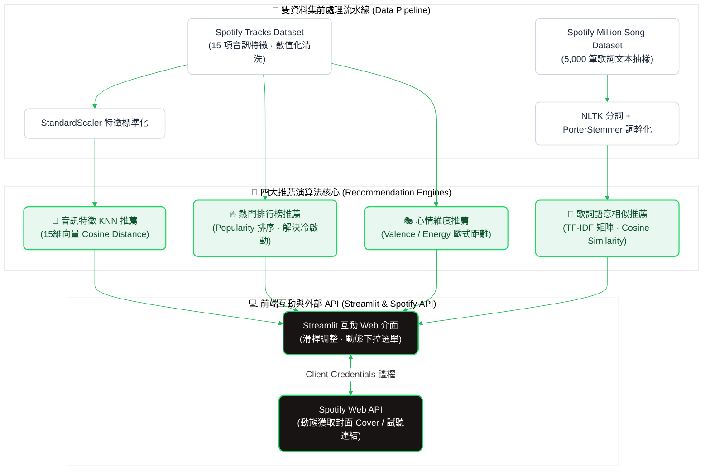

# Spotify 多維度混合音樂推薦系統 (Multi-Perspective Music Recommendation System)

> **專案小組成員**：廖冠筑、簡偉玲  
> **個人核心職責**：多維度推薦模型架構設計（KNN 音訊 / TF-IDF 歌詞 / 情緒向量空間）、文字探勘前處理流水線、Spotify Web API 非同步資料串接、Streamlit 互動介面封裝

---

## 📌 專案背景與核心價值 (Introduction)
面對音樂串流平台上海量的曲庫，使用者常面臨「知其感而不知其歌」的選曲困境。傳統單一推薦演算法往往難以兼顧使用者的即時心境或特定歌詞共鳴。

本專案基於 **Kaggle Spotify Tracks Dataset（15 項音訊特徵）** 與 **Million Song Dataset（歌詞語意）**，設計了一套整合四種維度的混合推薦系統，並串接 Spotify 官方 Web API，打造兼具演算法多樣性與即時播放互動的前端應用。

---

## 🏗️ 系統總體架構 (System Architecture)

---

## ⚙️ 四大多維度推薦模型實作細節

### 1. 🎵 基於內容的音訊特徵 KNN 推薦 (Content-Based Audio KNN)
* **特徵矩陣建置**：整合節奏律動（`danceability`, `tempo`）、能量強度（`energy`, `loudness`）、音色氛圍（`acousticness`, `liveness`, `speechiness`）與調性（`valence`, `mode`, `key`）共 15 項特徵。
* **標準化與距離度量**：使用 `StandardScaler` 消除各維度量綱差異，採用 **Cosine Distance** 衡量高維特徵向量之夾角方向：
  $$\text{Similarity} = 1 - \text{Cosine Distance}$$
* **查詢邏輯**：透過 $k+1$ 近鄰搜尋，動態排除輸入歌曲本身後，依 Similarity 排序輸出 Top-N 相似歌曲。

### 2. 🔥 熱門排行榜推薦 (Popularity-Based - Cold Start Mitigation)
* **冷啟動問題防護**：針對初次使用、無歷史收聽偏好或不確定目標歌曲的用戶，系統根據 `popularity`（0～100 官方熱度權重）進行排序。
* 支援使用者自定義選取排名範圍（如第 1～100 名），提供穩定的基線推薦，避免冷啟動體驗斷層。

### 3. 🎭 心情與情緒維度推薦 (Mood-Based Space Matching)
* **羅素情緒環形模型落地**：以 **Valence（心理正向度/快樂程度，0~1）** 與 **Energy（能量/活力感，0~1）** 構成二維心理情緒空間：
  $$\text{Mood Distance} = \sqrt{(\text{Valence} - V_{\text{target}})^2 + (\text{Energy} - E_{\text{target}})^2}$$
* **二階段過濾策略**：先設定動態容許區間（$\pm 0.01 \sim 0.1$）縮小候選集，再依「空間距離由近到遠」排序；若距離相近，則以 `popularity` 較高者優先展示。

### 4. 📝 歌詞語意文本相似推薦 (Lyrics TF-IDF Similarity)
* **NLP 文字探勘流水線**：抽樣 5,000 筆歌詞文本，經過小寫轉換、換行符清洗，並利用 **NLTK 進行斷詞** 與 **PorterStemmer 進行詞幹提取**。
* **向量化與夾角矩陣**：建立 $5000 \times 5000$ 的 TF-IDF 特徵相似度矩陣，當用戶輸入歌曲時，即時比對詞彙主題，精準找出意境相近的曲目。

---

## 🌐 Spotify Web API 串接與 UI 封裝

* **Client Credentials 鑑權機制**：使用 `spotipy` 模組透過客戶端授權流程獲取 Token，並實作連線健康檢查防呆。
* **動態資訊補全**：模型運算產出歌名與歌手後，非同步發送 API 請求提取高解析 **專輯封面（Cover Image）** 與 **官方串流跳轉連結（Spotify URL）**，大幅提升產品實用性。
* **Streamlit 原生互動**：提供直覺的雙滑桿（心情/能量調整）、即時下拉搜尋框與卡片式推薦排版。

---

## 📱 實機畫面與展示 (UI Screenshots)

| 01. 音訊 KNN 相似推薦 | 02. 熱門排行榜 (抗冷啟動) |
| :---: | :---: |
|  | |
| 輸入歌曲即時計算高維特徵相似度，輸出排序結果 | 支援使用者自訂熱門區間，提供即時曲目排行榜 |

| 03. Mood 心情雙軸推薦 | 04. 歌詞語意相似比對 |
| :---: | :---: |
| | |
| 拖動 Valence / Energy 滑桿，精準匹配當前心境歌曲 | 基於 TF-IDF 文本向量比對，挖掘歌詞主題相近之歌曲 |
